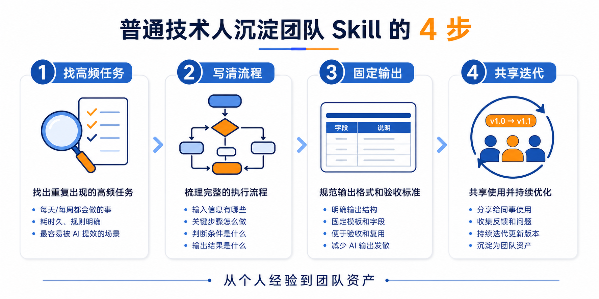

# AI 编程下一个分水岭：有人追工具，有人沉淀系统

最近我越来越强烈地感觉到一件事。

很多人用 AI 写代码，已经不缺工具了。

Claude Code、Codex、Cursor、通义灵码、Gemini……

工具越来越多。

模型越来越强。

插件越来越花。

但是团队真正的问题，并没有被完全解决。

问题是什么？

不是某个人会不会用 AI。

而是：

**一个人用 AI 摸出来的经验，怎么变成整个团队都能复用的能力？**

这个问题如果不解决，AI 编程很容易停留在“个人爽”的阶段。

你自己效率变高了。

你自己 prompt 写得越来越好。

你自己知道哪个命令能省时间。

你自己知道遇到某类 bug 应该怎么让 AI 查。

但换一个同事，还是从零开始。

新人来了，还是从零开始。

项目换了，还是从零开始。

这就很亏。

因为真正值钱的，不是某一次 AI 帮你写了一段代码。

而是你能不能把这次经验沉淀下来，让下一次、下一个人、下一个项目继续复用。

这就是我现在特别重视 Skill 的原因。

## 我以前也以为，会用 AI 就够了

我最早用 AI 编程的时候，也很兴奋。

让 AI 帮我读代码。

让 AI 帮我改 bug。

让 AI 帮我写脚本。

让 AI 帮我生成工具。

那种感觉很爽。

尤其是对我这种从硬件背景转软件的人来说，AI 真的像一根杠杆。

我大学是光电方向，偏硬件。

毕业后进过硬件公司，后来下班自学编程，6 个月转到软件行业，薪资翻倍。

再后来，我在真实工作里做自动化、CI、硬件测试和软件测试方向的开发。

所以我特别清楚一件事：

技术人最痛苦的，不是不会学新东西。

而是每天有太多重复、琐碎、规则明确但耗时间的事情。

比如：

读一堆历史代码。

整理测试需求。

生成测试用例。

写自动化脚本。

分析日志。

整理报告。

改一些重复出现的问题。

这些事情，你说它难吗？

不一定。

但它特别耗人。

所以一开始我用 AI，就是想解决这些问题。

那段时间我很容易陷入一个状态：

今天发现一个好 prompt。

明天改一个 Claude Code 配置。

后天写一个脚本。

大后天又收藏一个别人的 Skill。

看起来很努力。

但过一段时间我发现，这里面有个坑。

**我自己是变快了，但这些经验并没有自然变成团队资产。**

## 个人经验不沉淀，最后就是口口相传

团队里最常见的场景是什么？

一个人先摸出来一个好用方法。

比如他知道怎么让 AI 分析需求。

他知道怎么让 AI 生成测试用例。

他知道怎么让 AI 按项目规范改代码。

他知道怎么让 AI 生成报告模板。

然后别人问：

“你这个怎么配的？”

他就发一堆文件。

发一个 prompt。

发一个截图。

发一个链接。

再补一句：

“你照着放到这个目录里。”

问题来了。

对方放错目录怎么办？

版本不一致怎么办？

项目 A 能用，项目 B 不能用怎么办？

你自己后来改了，别人还是旧版本怎么办？

新人入职以后，又问一遍怎么办？

最后就会变成一种特别原始的协作方式：

靠人记。

靠人传。

靠人解释。

靠人反复发。

这不是 AI 工作流。

这叫“人工同步”。

而且越到团队规模变大，这个问题越明显。

AI 编程经验如果不沉淀，就像以前大家各自维护一套开发环境。

每个人机器上都有一堆配置。

谁也说不清哪个是最新的。

谁也不知道为什么能跑。

直到后来有了 package.json，有了 npm install，前端团队协作才真正稳定下来。

我现在看 Skill，也是一样的逻辑。

**AI 时代也需要自己的 package.json。**

只不过以前管理的是代码依赖。

现在管理的是 AI 工作经验。

## Skill 的本质，不是提示词，而是经验资产

很多人一听 Skill，就以为是提示词。

其实不是。

提示词只是表层。

真正的 Skill，应该包含一个人或一个团队做事的方法。

比如一个测试 Skill，不只是告诉 AI：

“帮我生成测试用例。”

而是要告诉 AI：

需求怎么拆。

边界条件怎么找。

异常场景怎么补。

测试数据怎么设计。

用例格式是什么。

验收标准是什么。

哪些公司内部信息不能暴露。

结果输出成什么结构。

这才是 Skill。

它不是一句咒语。

它是一套可执行的工作流。

我为什么一直说：人总是会忘记，但 Skill 不会？

因为很多经验，只要还停留在人脑里，就会丢。

人一忙，就忘。

人一走，就断。

人一换项目，就变形。

但你把它写成 Skill，它就可以被复用、被迭代、被审查、被传递。

这件事对个人有价值。

对团队更有价值。

对我这种想做 AI 一人公司的人，也很关键。

因为 Skill 本质上就是把经验产品化。

你今天沉淀一个 Skill，明天它可以帮你节省时间。

后天它可以变成课程案例。

再往后，它甚至可以变成一个产品模块。

这就是资产。

## 我现在做 AI 培训，最想讲清楚的就是这件事

我现在在工作里，也会给同事做 AI、Claude Code、Skill 相关的培训。

越做培训，我越发现一个问题。

很多人不是没有学习能力。

也不是不愿意用 AI。

他们真正卡住的是：

不知道从哪里开始。

不知道什么任务适合 AI。

不知道怎么把一次成功经验变成下次还能用的流程。

所以如果你只是告诉他：

“你要多用 AI。”

这句话没用。

太空了。

真正有用的是带他跑通一个闭环。

比如我现在最想打磨的一套课，不是讲一堆 AI 工具。

而是让测试工程师跑通一个真实流程：

**测试需求 → 测试 Skill → 测试用例 → 测试脚本 → 工作流提效。**

这条链路一旦跑通，他就不是“听懂了 AI”。

而是真的知道：

原来我的工作经验可以写进 Skill。

原来测试用例可以按我的规则生成。

原来自动化脚本可以先让 AI 出初稿。

原来我以后不用每次都从零开始。

这才叫提效。

不是听完课很激动。

而是第二天回去能用。

## 为什么团队一定需要 Skill 资产库？

因为团队协作最怕三件事。

第一，经验只在高手脑子里。

一个人很强，但他的方法没有沉淀。

别人学不到。

他一忙，团队就堵住。

第二，每个人的 AI 配置都不一样。

你有你的 prompt。

我有我的规则。

他有他的命令。

同一个任务，三个人做出来三个风格。

第三，重复问题反复解决。

今天 A 同事踩一次坑。

明天 B 同事再踩一次。

后天新人又踩一次。

这不是团队不会学习。

是团队没有记忆系统。

所以我现在判断一个团队 AI 化到什么程度，不只看它用了多少工具。

我更看三件事：

有没有沉淀 Skill？

有没有统一入口？

有没有持续迭代？

如果没有，那很可能只是“每个人各玩各的”。

看起来很热闹。

但很难形成组织能力。

## sx 这类工具，真正有意思的地方在这里

原文里提到的 sx，我觉得它的价值不只是“又一个新工具”。

如果只是工具介绍，那没什么意思。

真正值得关注的是它背后的趋势：

**AI 编程资产开始需要包管理器了。**

以前我们管理代码依赖。

现在要管理 AI 经验依赖。

以前 npm 管 JavaScript 包。

现在 sx 这类工具想管理 Skill、规则、命令、MCP 配置、hooks、agents。

这说明什么？

说明 AI 编程正在从个人手艺，走向工程化协作。

一个团队以后可能会有：

代码审查 Skill。

需求分析 Skill。

测试用例 Skill。

日志分析 Skill。

接口文档 Skill。

报告生成 Skill。

新人 onboarding Skill。

每个 Skill 都有版本。

有适用范围。

有团队归属。

有安装方式。

有更新记录。

这件事听起来有点远，但其实很现实。

因为我自己现在管理各种 Skill、文案流程、知识库、飞书 CLI、微信读书 CLI、公众号发布脚本的时候，已经明显感觉到：

如果没有规范，很快就乱。

如果没有统一入口，很快就忘。

如果没有版本意识，很快就不知道哪个才是对的。

工具可以换。

但这个方向不会变。

## 普通技术人可以怎么开始？

你不需要一上来就搞一个很复杂的平台。

我建议从 4 步开始。

### 第一步，先找一个高频重复任务

不要一上来就说：

“我要搭建团队 AI 平台。”

太大了。

先找一个每天、每周都会重复出现的任务。

比如：

生成测试用例。

分析 bug 日志。

写接口文档。

做代码 review。

生成周报。

整理会议纪要。

越具体越好。

AI 提效最怕大而空。

任务越具体，越容易做出结果。

### 第二步，把你平时怎么做写下来

这一步最关键。

不要一开始就写 prompt。

先写你的流程。

比如你分析一个 bug，平时会看什么？

先看日志？

再看调用链？

再看最近变更？

再复现？

最后怎么输出结论？

这些东西写下来，就是 Skill 的骨架。

很多人写不好 Skill，不是因为提示词能力差。

而是因为自己做事流程都没想清楚。

流程不清楚，AI 只会更乱。

### 第三步，把输出格式固定下来

AI 最容易发散。

所以你一定要规定输出格式。

比如测试用例必须包含：

用例编号。

前置条件。

操作步骤。

预期结果。

优先级。

是否可自动化。

比如代码审查必须输出：

风险点。

影响范围。

修改建议。

是否需要补测试。

回滚方案。

格式固定以后，你才好验收。

好验收，才叫工作流。

不好验收，就是聊天。

### 第四步，再考虑共享和版本管理

个人先跑通。

小组再复用。

团队再规范。

不要反过来。

一开始就追求“大而全”，很容易死在工具选择上。

先做一个能解决真实问题的小 Skill。

让它在你自己手里用起来。

再给同事试。

发现哪里不好，再迭代。

等它真的稳定了，再考虑用 Git、sx 或其他工具统一管理。

这就是我一直说的：

先起飞，空中加油。

不要等系统完美了再开始。

你永远等不到那一天。

## AI 编程的下一个分水岭

我觉得 AI 编程接下来会出现一个分水岭。

一类人继续追工具。

今天换模型，明天换插件，后天换编辑器。

每天都很忙，但没有沉淀。

另一类人开始沉淀自己的工作流。

把高频任务写成 Skill。

把项目经验写成 SOP。

把团队规范写成规则。

把工具配置做成可复用资产。

短期看，第一类人更热闹。

长期看，第二类人会越来越强。

因为他们每做一次，系统就进化一次。

每踩一次坑，团队就少踩一次。

每沉淀一个 Skill，后面就少重复一轮。

这就是复利。

我现在做 AI 一人公司，本质上也是这个逻辑。

不是靠一次爆发。

而是把自己的能力、内容、知识库、工具、工作流、案例，持续沉淀成资产。

个人是这样。

团队也是这样。

## 最后说句实在的

如果你现在用 AI 编程，只是自己爽一下，那还不够。

你要开始想：

这次成功经验，能不能沉淀？

这个 prompt，能不能变成 Skill？

这个流程，能不能给同事复用？

这个项目经验，能不能变成团队资产？

AI 时代最稀缺的，不是工具。

工具会越来越多。

模型会越来越强。

真正稀缺的是：

**你有没有把经验资产化的能力。**

对技术人来说，这件事尤其重要。

因为未来不是谁收藏的工具多，谁就厉害。

而是谁能把工具接进真实工作流，谁能把经验沉淀成可复用系统，谁就会越来越强。

所以，别再只追新工具了。

从今天开始，写下你的第一个 Skill。

不用完美。

先解决一个真实问题。

每一步都算数。

先起飞，空中加油。

