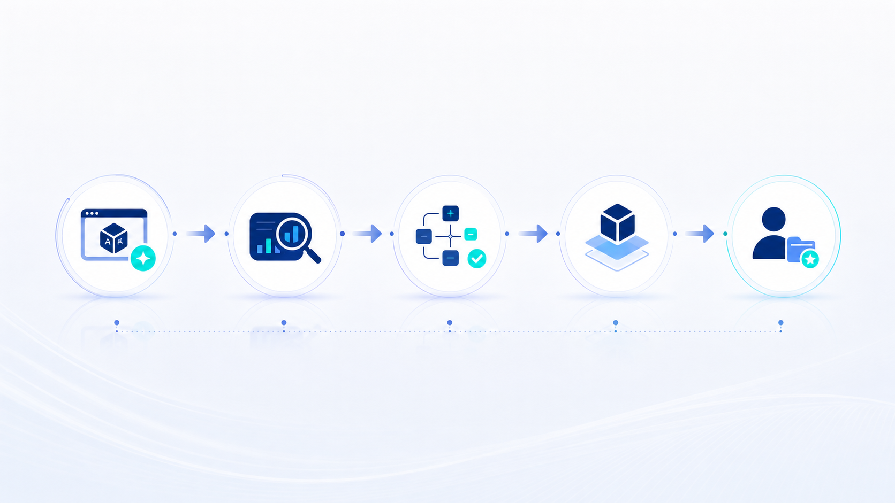

# Claude Opus 4.8 没有炸裂，炸裂的是我们对 AI 的浮躁

你有没有发现一件事？

现在每一次新模型发布，中文 AI 圈都会进入一种很熟悉的节奏。

先是朋友圈刷屏。

然后是各种“炸裂”“碾压”“重新定义”“王炸来了”。

再然后，一堆人还没真正测，就开始转发跑分图、做结论、催你赶紧上车。

你看完之后，会有一种很微妙的焦虑：

是不是我又落后了？

是不是昨天刚学会的工具，今天又不够用了？

是不是我不马上切到最新模型，就会被别人甩开？

如果你也有过这种感受，我想说，你并不孤单。

这不是你不够冷静。

这是 AI 时代最容易被放大的一个心理陷阱：**我们把“模型更新”误以为是“能力跃迁”，又把“能力跃迁”误以为是“自己必须马上改变”。**

最近 Claude Opus 4.8 发布，很多人又开始说“炸裂”。

但我去看了 Anthropic 官方博客，官方自己的表述其实很克制。

他们说 Opus 4.8 是一次 “modest but tangible improvement”——温和但可感知的改进。

这句话很有意思。

离模型最近的人，反而没有说炸裂。

离模型最远的人，倒是先替它炸了。

这可能就是今天最值得聊的地方。

Claude Opus 4.8 本身当然有进步。

它有 Effort 控制，可以让用户选择模型这次思考得深一点还是快一点；Claude Code 有 dynamic workflows，可以在大任务中调度并行子 Agent；fast mode 速度更快，成本也降了；官方还强调它在诚实性、自我纠错、减少无依据自信方面有提升。

这些都是真实变化。

但问题是：

**真实变化，不等于时代巨变。**

**有用更新，不等于必须狂欢。**

**模型更强，不等于你自动变强。**

我越来越确定，AI 时代真正拉开差距的，不是谁第一时间转发了最新模型发布会。

而是谁能在每一次热闹之后，冷静地问一句：

这个更新，到底能不能进入我的真实工作流？

## 一、AI 圈最大的浮躁，是把“新闻”误当成“能力”

过去一年，我见过太多类似的场景。

一个新模型刚发布，大家立刻开始转发跑分。

一个新工具刚上线，大家立刻说要重构工作流。

一个新 Agent 刚出现，大家立刻喊“程序员要完了”。

但真正过一周再看，会发现很多东西并没有进入日常。

你还是用原来的方式写代码。

还是用原来的方式整理文档。

还是用原来的方式做测试、写报告、改 bug。

区别只是你的收藏夹里又多了十几篇文章。

这就是 AI 圈最隐蔽的一个陷阱：**信息摄入的快感，很容易被大脑误判为能力增长。**

你看了模型发布，感觉自己跟上了时代。

你转发了跑分图，感觉自己掌握了趋势。

你收藏了测评文章，感觉自己已经学会了新工具。

但真实能力不是这样来的。

真实能力来自你在具体场景里跑过一次、踩过一次坑、修过一次流程、沉淀过一次经验。

我自己做 AI 编程和工作流这段时间，越来越能感受到这一点。

看十篇 Claude Code 的测评，不如真的拿它改一次 bug。

听十个人说 Skill 很重要，不如自己写一个能跑通的 Skill。

收藏十个 AI 工具清单，不如把自己每天重复做的一件事自动化掉。

这不是反对关注新模型。

恰恰相反，技术人当然要关注变化。

但关注变化和被变化牵着跑，是两回事。

**AI 新闻是输入，真实工作流里的结果才是输出。**

如果一个更新没有进入你的工作流，它最多只是信息。

信息不沉淀，就不会变成能力。

## 二、跑分最容易制造幻觉，因为它让复杂问题看起来有了唯一答案

这次 Opus 4.8 里，跑分讨论又成了焦点。

跑分当然有价值。

没有评测，大家就只能靠感觉判断模型强弱。

但问题在于，很多人把跑分看成了唯一答案。

只要某个榜单高一点，就说碾压。

只要某个指标低一点，就说不行。

可真实工作不是一张表格。

你做一个项目，不只看模型会不会答题。

你还要看它是否稳定，是否听得懂你的上下文，是否能遵守项目约束，是否会乱改代码，是否会在不确定时承认不知道，是否能和你的工具链配合。

尤其是 AI 编程。

我现在越来越不迷信单一跑分。

因为真实开发里，模型犯错的方式比跑分复杂得多。

它可能某个算法题很强，但一进你的历史代码库就开始胡改。

它可能某个 benchmark 很高，但面对真实业务约束时判断很差。

它可能生成代码很快，但不愿意跑测试、不愿意回看日志、不愿意承认自己刚才错了。

这些东西，跑分很难完全体现。

所以我更关心三个问题。

第一，它能不能稳定完成我的真实任务？

第二，它出错之后，能不能被我纠正，并且下次少犯同类错误？

第三，它能不能融入我的现有流程，而不是让我为了它重写一整套流程？

这三个问题，才是普通技术人真正应该关心的。

模型榜单可以看。

但不要把榜单当信仰。

**跑分是地图，不是地形。真实工作流，才是你脚下的路。**

## 三、Opus 4.8 真正值得关注的，不是“炸裂”，而是几个更务实的变化

如果把情绪放一边，Opus 4.8 这次其实有几个值得认真看的点。

第一个，是 Effort 控制。

这件事看起来不大，但我觉得方向是对的。

过去很多 AI 工具的问题是，模型自己决定什么时候认真、什么时候敷衍。

你明明在处理一个复杂任务，它却给你一个很快但很浅的答案。

你只是问一个小问题，它又消耗一堆 token，开始长篇大论。

这本质上是控制权的问题。

Effort 控制的意义，不只是“想深想浅可以选”。

更重要的是，它让用户开始参与模型资源调度。

什么时候要快，什么时候要稳，什么时候值得多花 token，什么时候只需要一个粗略答案。

这些判断，不应该完全交给模型。

人应该参与进来。

第二个，是 Claude Code 的 dynamic workflows。

官方说它可以在一个会话里规划任务、运行并行子 Agent，并在报告前验证输出。

如果这个能力在真实项目里足够稳定，它的意义会很大。

因为 AI 编程正在从“单次问答”，走向“工程级协作”。

过去我们让 AI 写代码，常常是一问一答。

现在更像是：给它一个目标，让它拆任务、并行处理、跑测试、合并结果、再汇报。

这已经不是聊天机器人了。

这是工作流系统。

第三个，是官方强调的 honesty。

也就是模型更愿意承认不确定，更少把没验证的东西说得像真的。

这个点我特别在意。

因为在真实工作里，一个 AI 最可怕的不是不会。

最可怕的是不会还很自信。

它信誓旦旦地告诉你 bug 修好了，结果测试没跑。

它说已经检查过所有文件，结果漏掉关键目录。

它说这个方案没问题，结果一上线就翻车。

所以，AI 的“诚实性”不是道德问题。

它是工程质量问题。

**一个愿意承认不确定的模型，比一个永远显得很聪明的模型，更适合进入真实工作流。**

这也是我判断 Opus 4.8 的核心角度。

它不一定炸裂。

但如果它真的更会自查、更愿意暴露不确定、更能配合长任务，那它就是一个有价值的工程更新。

## 四、普通人最容易犯的错，是把“模型升级”当成“自己升级”

这里有一个很扎心的问题。

模型升级了，和你有什么关系？

这句话听起来有点冒犯。

但它很重要。

Claude Opus 4.8 更强了，不代表你的工作流更强了。

Fast mode 更便宜了，不代表你的产出成本真的降了。

Dynamic workflows 更厉害了，不代表你就能让它跑好一个项目。

Effort 控制更灵活了，不代表你知道什么时候该用 high，什么时候该用 max。

工具的能力，只是外部条件。

你的能力，取决于你能不能把它接入自己的系统。

我见过很多人学 AI，一直停留在“工具追新”的状态。

今天学这个模型，明天换那个插件，后天又研究新的工作台。

每一次都很兴奋。

但过一段时间回头看，自己的流程没有变，知识库没有变，Skill 没有变，工作产出也没有明显变化。

这就是典型的“工具性忙碌”。

看起来一直在学习，其实一直没有内化。

真正有用的学习，一定会留下痕迹。

比如你多了一个稳定的提示模板。

多了一个可复用的 Skill。

多了一个自动化脚本。

多了一套 bug 定位流程。

多了一份自己的模型使用标准。

多了一个明确知道“什么时候该用哪个模型”的判断框架。

这些东西，才是能力增长的证据。

不是你看过多少测评。

不是你试过多少模型。

不是你在朋友圈多早转发。

**模型更新是别人的进步；工作流更新，才是你的进步。**

## 五、技术人应该建立自己的“模型验收标准”

那普通技术人应该怎么面对新模型？

我的建议很简单：不要第一时间站队，不要第一时间吹，也不要第一时间骂。

先建立自己的验收标准。

我现在看一个新模型，通常不会只看官方发布和别人测评。

我会把它放进自己的几个真实场景里试。

第一，读一个真实项目。

看它能不能理解项目结构，能不能找出关键文件，能不能区分业务逻辑和工具代码。

第二，改一个真实 bug。

不是玩具 bug，而是那种需要看日志、读调用链、理解上下文的问题。

看它会不会瞎猜，会不会主动验证，会不会跑测试。

第三，写一个小工具。

看它能不能从需求到实现再到验收，完整跑一遍。

第四，整理一段复杂材料。

看它能不能提炼重点，保留上下文，不要把模糊信息编成确定结论。

第五，长期协作一段时间。

看它是否能维持风格、理解偏好、遵守约束，而不是每次都像新来的实习生。

这些测试不一定标准化。

但它们属于我自己的真实工作流。

这比看一张跑分表更有用。

因为我最终不是拿模型去参加考试。

我是拿模型来干活。

你也可以建立自己的模型验收清单。

不用复杂。

就问五个问题：

1. 它能不能解决我真实重复遇到的问题？
2. 它能不能减少我的时间消耗，而不是制造新的调试成本？
3. 它出错时，我能不能看出来？
4. 它能不能被我约束在明确边界内？
5. 它的输出能不能沉淀进我的知识库、Skill 或 SOP？

只要这五个问题回答不清楚，再炸裂的模型，对你来说也只是热闹。

## 六、AI 时代真正稀缺的，是克制使用工具的能力

很多人以为 AI 时代要拼的是追新速度。

谁第一时间知道新模型，谁第一时间用上新功能，谁第一时间发测评，谁就更领先。

但我越来越觉得，真正稀缺的反而是另一种能力：克制。

不是不看新东西。

而是看完之后，不立刻被它带走。

你要能分清：

这是产品更新，还是营销叙事？

这是能力提升，还是跑分优化？

这是适合我的工作流，还是只适合别人发文章？

这是必须马上迁移，还是可以先观察一周？

克制不是保守。

克制是一种判断力。

尤其对普通人来说，注意力是最贵的资源。

你每天追十个新工具，就很难沉淀一个旧流程。

你每天收藏二十篇测评，就很难真正跑通一个 Skill。

你每天被“炸裂”牵着走，就很难建立自己的节奏。

而 AI 提效最重要的，恰恰是节奏。

你要知道自己现在最重要的问题是什么。

你要知道哪类任务最值得自动化。

你要知道什么东西应该进入知识库。

你要知道什么经验值得沉淀成 Skill。

你要知道什么时候该让 AI 做初稿，什么时候必须自己判断和验收。

这些东西，没有任何一个新模型会自动送给你。

它们只能从你的真实使用里长出来。

**AI 时代最值钱的，不是追上每一次更新，而是不被每一次更新打乱自己的系统。**

## 最后说句实在的

Claude Opus 4.8 没有必要被神化。

它有进步。

Effort 控制是好方向，dynamic workflows 值得关注，fast mode 降成本也很实在，诚实性提升对工程使用很重要。

但它也没有必要被写成一场“炸裂革命”。

真正炸裂的，可能不是模型。

而是我们面对 AI 时越来越失控的注意力。

一个新模型发布，我们就焦虑一次。

一个新跑分出现，我们就改判断一次。

一个新工具刷屏，我们就怀疑自己是不是落后一次。

长此以往，人会很累。

你会一直站在时代的新闻流里，却没有真正建立自己的能力系统。

所以，比起问“Opus 4.8 到底强不强”，我更建议你问自己一个更具体的问题：

**这次更新里，有没有一个能力，能进入我的真实工作流？**

如果有，就把它接进来。

写成流程。

跑一次任务。

记录失败点。

沉淀成 Skill。

如果没有，那就看完、知道、放下。

不用焦虑。

不用急着站队。

不用每次都跟着别人一起喊炸裂。

AI 时代真正的上坡路，往往不是最热闹的那条路。

它更像是一件很安静的事情：

你把一个重复任务跑通。

把一次踩坑记下来。

把一个流程沉淀成模板。

把一个模板变成 Skill。

把 Skill 接进自己的知识库和工作流。

一点点做。

一点点积累。

最后你会发现，真正让你变强的，不是某一天突然发布的新模型。

而是你没有被每一次热闹带走，而是持续把外部工具，变成了自己的内部系统。

这才是普通人在 AI 时代最应该守住的东西。

## 写在最后：给技术人的一个入口

所以，如果你是程序员、测试工程师，或者任何一个想用 AI 提效的技术人。

我建议你别再只追新模型了。

从今天开始，选一个你真实工作里反复遇到的问题。

让 AI 帮你跑一遍。

把过程记下来。

把失败点补进去。

把它沉淀成一个属于你自己的 Skill。

不用完美。

先解决一个真实问题。

因为 AI 时代真正值钱的，不是你知道多少新模型。

而是你有没有能力，把模型变成自己的工作流，把工作流变成资产。

我后面会持续写这些内容：

- AI 编程怎么接入真实项目；
- Claude Code / Codex 怎么真正用起来；
- 普通技术人怎么写自己的 Skill；
- 怎么用 Obsidian 搭个人知识库；
- 怎么把一次踩坑，沉淀成下一次可复用的 SOP。

如果你也想系统学习 AI 编程、AI 工作流和 Skill 搭建，可以继续关注我。

我会把自己在真实工作中踩过的坑、跑通的流程、沉淀出来的 Skill 模板，一步步拆给你看。

你踩的坑，我都踩过了。

每一步都算数。

先起飞，空中加油。

