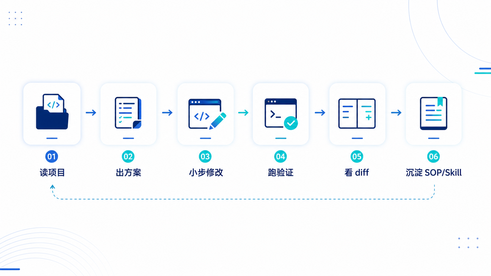

# 普通技术人用 Codex 的第一课：不是让 AI 写代码，而是让 AI 接管一段真实工作流

你有没有过这样的感受？

AI 编程工具越来越多，但你真正用起来的时候，还是有点虚。

你看别人用 Codex、Claude Code、Cursor，好像已经进入了“AI 工程师替我干活”的阶段。

但轮到自己打开工具，第一句话却不知道该怎么说。

你想让它帮你改代码，又怕它乱改。

你想让它跑命令，又怕它把项目搞坏。

你想把权限开大一点，又担心它碰到不该碰的文件。

最后，很多人用 AI 编程，还是退回到最熟悉的方式：

复制一段代码，问它这是什么意思。

复制一个报错，问它怎么解决。

让它生成一个函数，再自己手动粘进去。

这当然也有用。

但如果 AI 编程只停留在这里，其实有点可惜。

因为 Codex 这类工具真正改变的，不是“AI 能不能帮你写几行代码”。

而是它第一次让普通技术人有机会把 AI 接进真实项目，让它读上下文、改文件、跑命令、看 diff、做验证，甚至把一段重复工作沉淀成流程。

这才是关键。

**普通技术人用 Codex 的第一课，不是学安装，也不是背提示词。**

**而是理解一件事：你不是在找一个更聪明的聊天框，而是在训练一个可控的临时工程师。**

这个认知一旦变了，你用 AI 编程的方式会完全不一样。



## 一、很多人学 AI 编程，第一步就走偏了

很多人第一次接触 AI 编程，脑子里想的是：

我要让它帮我写代码。

这个想法没错，但太窄了。

因为真实开发里，写代码只是其中一小部分。

你要先读需求。

要理解项目结构。

要找到相关文件。

要判断改动范围。

要小心不要破坏原有逻辑。

要跑 lint、test、build。

要看 diff。

要写变更说明。

要确认有没有引入风险。

这些动作，才构成一个完整的工程任务。

过去我们把 AI 当成“代码生成器”，所以用法自然很单薄。

你问一句，它答一句。

它生成一段，你复制一段。

这就像你请了一个实习生，却只让他在旁边帮你查资料，从来不让他参与真实任务。

Codex 真正不一样的地方，是它开始进入工程现场。

根据 OpenAI 官方对 Codex 的定位，它不是只存在于一个聊天窗口，而是尽量出现在你写代码、审代码、跑项目、处理工作流的地方。官方也把 Codex 的典型场景放在真实代码库、前端构建、PR review、文档更新、自动化任务这些“可执行工作”里。

这说明一个方向：AI 编程正在从“问答工具”，变成“工作流工具”。

所以你第一天用 Codex，不应该问：

它能不能写出很厉害的代码？

你应该问：

**它能不能帮我推进一个低风险、可验证、能复盘的小任务？**

这才是正确入口。

## 二、Codex 入门最重要的原则：小任务、小权限、强验收

如果你问我普通技术人第一次用 Codex 最应该记住哪句话。

我会说：

**小任务、小权限、强验收。**

这句话比任何安装教程都重要。

因为 AI 编程最大的问题，不是 AI 不够强。

而是很多人一上来就给它一个又大又模糊的任务。

比如：

“帮我优化一下这个项目。”

“帮我重构一下代码。”

“帮我看看哪里有问题。”

这些话听起来很自然，但对一个能真正改文件、跑命令的 Agent 来说，非常危险。

因为你没有告诉它：

可以改哪里？

不能改哪里？

怎样算完成？

改完怎么验证？

风险边界是什么？

最后它只能猜。

AI 最可怕的地方，不是不会。

而是它一边猜，一边显得很自信。

所以第一天不要拿生产项目试。

不要上来就让它改核心模块。

不要一开始就把权限开到最大。

最稳的做法，是拿一个低风险任务开始。

比如：

- 只读项目，不改代码；
- 整理 README；
- 找出测试命令；
- 解释项目结构；
- 修一个低风险文案问题；
- 生成一份调用链分析；
- 对当前 diff 做 review，但不修改。

你真正要观察的，不是它最后答案写得漂不漂亮。

而是四件事：

1. 它读了哪些文件；
2. 它准备改哪些文件；
3. 它运行了哪些命令；
4. 它用什么证明自己做完了。

这四件事看懂了，你才算真正开始用 Codex。

否则你只是在让 AI 盲飞。

## 三、提示词不是玄学，本质上是给 AI 写一份小需求文档

很多人把提示词想复杂了。

好像必须掌握某种咒语，AI 才会听话。

但我自己用 AI 编程越久，越觉得提示词没有那么玄。

它更像一份很小的需求文档。

尤其是 Codex 这种能进入项目、修改文件、运行命令的工具，你不能只给它一句愿望。

你要给它任务边界。

最简单的结构就是五个词：

**背景、目标、范围、约束、验收。**

比如你可以这样写：

```text
背景：
这是一个 React + TypeScript 项目，我现在要处理用户设置页的问题。

目标：
保存按钮在请求中显示 loading，并禁止重复点击。

范围：
可以修改 settings 页面和相关 hook。
不要改接口层，不要改路由，不要改全局样式系统。

约束：
优先复用已有 Button 组件。
不要新增依赖。
不要改变现有 API。

验收：
1. 请求中按钮显示 loading；
2. 请求未结束前不能重复提交；
3. 请求失败后按钮状态恢复；
4. 运行现有 lint 或测试；
5. 最后说明改了哪些文件。
```

你看，这里面没有任何神秘技巧。

只是把一个靠谱工程师本来就该知道的信息说清楚。

这也是我想提醒很多技术人的地方。

AI 编程不是让你不写需求了。

恰恰相反，它会倒逼你把需求写得更清楚。

你越模糊，AI 越容易乱猜。

你越清楚，AI 越像一个能干活的人。

所以普通技术人学 Codex，第一阶段不要追求“高级 prompt”。

先把这五件事说清楚：

- 这个项目是什么；
- 这次任务要做什么；
- 哪些文件能动；
- 哪些边界不能碰；
- 怎样证明完成了。

这就够你超过很多只会喊“帮我优化一下”的人了。

## 四、真正的 AI 编程，不是让它改完，而是让它证明自己改对了

Codex 做完任务之后，最危险的时刻来了。

因为很多人会看到它说“完成了”，就真的以为完成了。

这一步非常要命。

AI 写代码和人写代码一样，都要验收。

甚至更要验收。

因为 AI 的表达通常太流畅，它很容易让你产生一种错觉：

它说得这么像真的，应该没问题吧。

但工程不是靠语气确认的。

工程靠证据确认。

你至少要看五个东西：

1. 它改了哪些文件？
2. 有没有改到任务范围之外？
3. 有没有新增不必要的依赖？
4. 有没有跑 lint / test / build？
5. 有没有留下调试代码、假数据、敏感信息？

这就是“强验收”。

我自己现在用 AI 编程，非常在意这一步。

因为我不是全职测评博主，我还在真实工作里写代码、做自动化、管 CI。

真实项目不是 Demo。

Demo 翻车，最多截图不好看。

真实项目翻车，会影响别人使用，会影响团队节奏，会影响线上质量。

所以我一直坚持一个原则：

**AI 负责生成，人负责判断和验收。**

你可以让 Codex 改代码。

可以让它跑测试。

可以让它分析日志。

可以让它给出方案。

但最后合不合并，能不能进主分支，风险能不能接受，这个判断必须在人这里。

这不是保守。

这是工程责任。

如果你想让 Codex 更可靠，可以在任务最后固定加一句：

```text
完成后请按文件列出改动，并说明：
1. 为什么改；
2. 具体改了什么；
3. 有什么风险；
4. 用什么命令验证过。
```

这句话看起来很普通。

但它会逼 AI 从“我改完了”，回到“我怎么证明我改对了”。

这才是 AI 编程的分水岭。

## 五、AGENTS.md 的意义，不是多一个文件，而是让 AI 不再每次从零理解你

原文里提到 AGENTS.md，我觉得这是 Codex 入门里最值得单独拎出来讲的东西。

很多人用 AI 工具低效，不是因为模型差。

而是因为每次都从零开始解释。

这个项目怎么启动，你说一遍。

测试命令是什么，你说一遍。

哪些目录不能动，你说一遍。

代码风格是什么，你说一遍。

发布前要检查什么，你再说一遍。

说久了，人会累。

AI 也未必每次都记得住。

所以项目需要一个固定的上下文入口。

README 是给人看的。

AGENTS.md 更像是给 AI 看的项目规矩。

里面可以写：

```markdown
# AGENTS.md

## 项目说明
这是一个 React + TypeScript 项目。

## 常用命令
- 安装依赖：pnpm install
- 本地开发：pnpm dev
- Lint：pnpm lint
- 测试：pnpm test
- 构建：pnpm build

## 修改规则
- 修改前先读 README 和 package.json。
- 不要新增依赖，除非说明理由。
- 不要修改数据库 schema，除非用户明确要求。
- 完成后必须说明改了哪些文件，以及跑了哪些命令。
```

这不只是一个文件。

它本质上是在把你的项目经验沉淀成 AI 能读取的 SOP。

这和我一直说的 Skill 是同一个逻辑。

人总是会忘，但 Skill 不会。

人总是会漏，但 SOP 可以提醒。

人每次都重新解释上下文很累，但固定文档可以让 AI 每次从同一个标准起步。

你会发现，真正让 AI 越用越顺的，不是某一次 prompt 写得多好。

而是你有没有把自己的工作习惯、项目规则、验收标准沉淀下来。

**提示词是临时沟通，AGENTS.md 是项目记忆，Skill 是可复用能力。**

这三件事如果能串起来，你用 Codex 就不再是“试一下工具”。

而是在搭建自己的 AI 编程系统。

## 六、Codex 对测试工程师也很重要，因为它天然适合“验证型工作流”

很多人一看到 Codex，就觉得这是程序员工具。

但我反而觉得，测试工程师、自动化工程师，更应该关注它。

因为测试工作的核心，不只是点点点。

而是理解需求、拆验收点、设计用例、跑验证、看日志、定位风险、输出报告。

这些环节里，有很多都适合 AI 参与。

比如：

- 让 Codex 阅读需求和 PR，提取验收点；
- 让它根据代码改动生成测试关注点；
- 让它分析失败日志，定位可能原因；
- 让它补充自动化测试脚本；
- 让它整理 CI 失败报告；
- 让它检查文档和实际行为是否一致。

这和你的职位是不是“开发”没有那么大关系。

关键是你有没有一个可验证的工作流。

我做自动化和 CI 很清楚，真正浪费时间的往往不是“写一段代码”。

而是大量重复判断：

这个失败是不是环境问题？

这个日志里关键错误在哪里？

这个改动影响哪些用例？

这次报告要怎么整理？

这些任务如果每次都靠人从头看，非常消耗精力。

但如果你把规则沉淀下来，Codex 就可以变成一个很好的辅助工程师。

不是替你负责。

而是帮你先做第一轮整理、排查和验证。

最后你来判断。

这也是普通测试工程师用 AI 的突破口。

不要一上来就问“AI 能不能替代测试”。

这个问题太大，也太容易制造焦虑。

你应该先问：

**我每天有哪些重复的验证、分析、整理工作，可以先交给 AI 做第一版？**

这个问题更具体，也更有用。

## 七、普通技术人可以从一个 7 天练习开始

如果你现在还没有真正用过 Codex，我建议不要贪多。

先用 7 天，跑一个最小闭环。

第一天，只读项目，不改代码。

让它告诉你项目结构、启动方式、测试命令、建议的三个小任务。

第二天，只改文档。

让它补 README、本地启动说明、常见问题。

第三天，修一个低风险问题。

比如文案不一致、注释不清楚、配置说明缺失。

第四天，让它做 code review。

只给意见，不改代码。

第五天，让它跑一次验证。

比如 lint、test、build，或者整理失败原因。

第六天，写一个最简单的 AGENTS.md。

把项目启动、测试命令、修改边界、验收要求写进去。

第七天，把这 6 天的过程沉淀成一个 Skill 或 SOP。

这 7 天跑完，你会得到的不是“我试用了 Codex”。

而是一套最小 AI 编程工作流。

这套东西不一定很高级。

但它是真实的。

真实，比高级重要。

因为很多人学 AI 的最大问题，就是永远停留在看别人怎么用。

别人一个视频很爽。

别人一个案例很炸。

别人一个工具很神。

但你自己的工作流没有任何变化。

这就没有意义。

**AI 提效不是从收藏教程开始的，而是从跑通一个自己的闭环开始的。**

## 最后说句实在的

Codex 值不值得写？

值得。

但它不应该被写成又一篇工具说明书。

对我来说，Codex 真正值得写的地方，不是它有多少入口、多少按钮、多少模式。

而是它代表了普通技术人使用 AI 的一个关键转折：

从“问 AI 一个问题”，走向“让 AI 推进一段任务”。

从“复制代码给 AI 看”，走向“让 AI 进入项目上下文”。

从“每次重新写 prompt”，走向“把规则沉淀成 AGENTS.md、Skill 和 SOP”。

从“工具用完就完”，走向“经验持续变成资产”。

这才是我真正关心的。

如果你是程序员、测试工程师，或者任何一个想用 AI 提效的技术人。

我建议你别再只看别人怎么用 Codex 了。

从今天开始，拿一个安全的小项目，跑一次自己的 Codex 工作流。

不要一上来追求复杂。

只做一件事：

让它读项目。

让它出方案。

让它改一个小地方。

让它跑一次验证。

让它告诉你改了什么、怎么证明做对了。

然后，把这套过程记下来。

这就是你的第一个 AI 编程 SOP。

以后我会继续拆：

- Codex 怎么读真实项目；
- Codex 怎么辅助测试和 CI；
- AGENTS.md 应该怎么写；
- 怎么把一次成功经验沉淀成 Skill；
- 普通技术人怎么从 AI 编程走向 AI 工作流。

你踩的坑，我都踩过了。

每一步都算数。

先起飞，空中加油。

